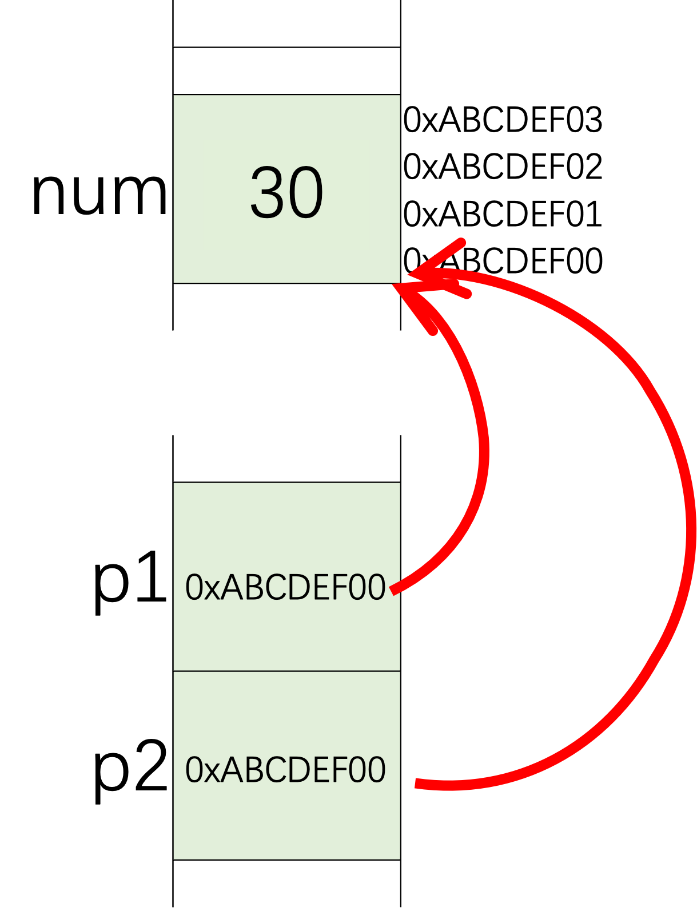
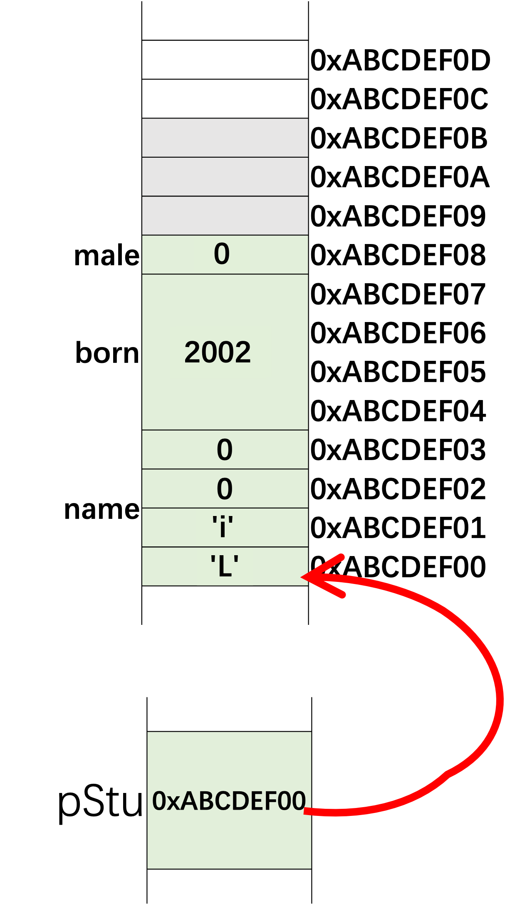
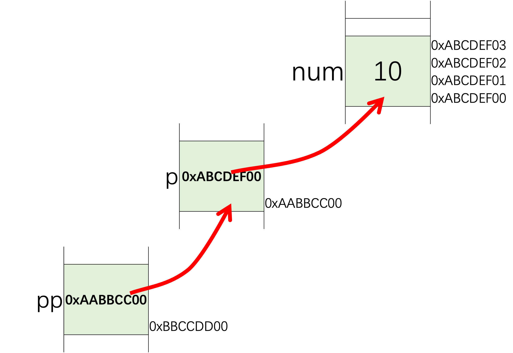
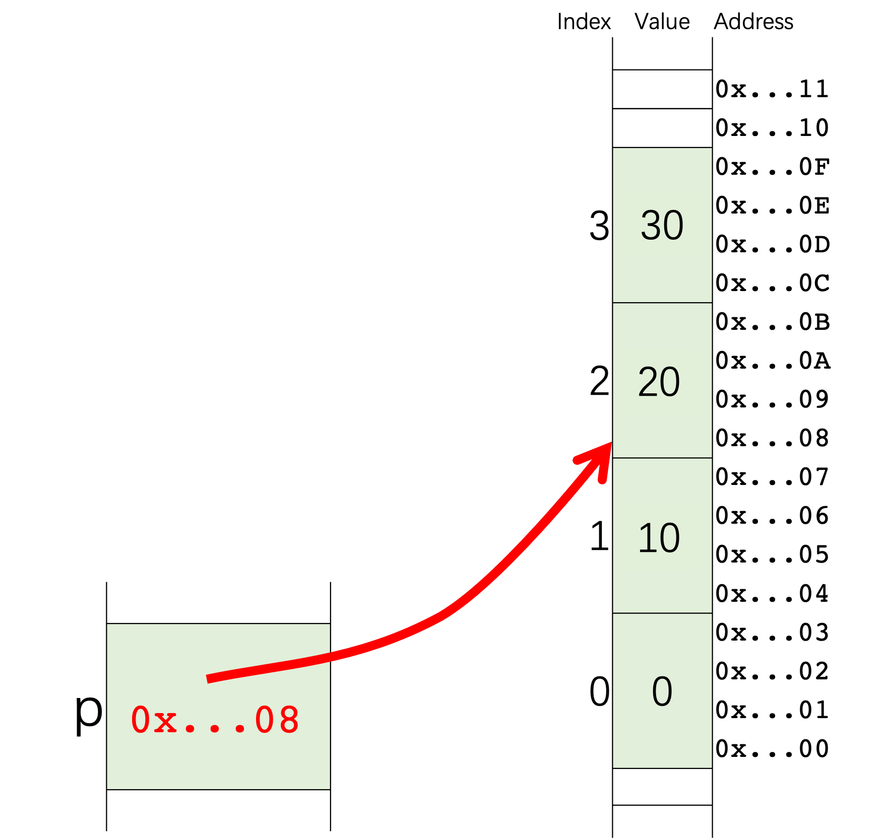
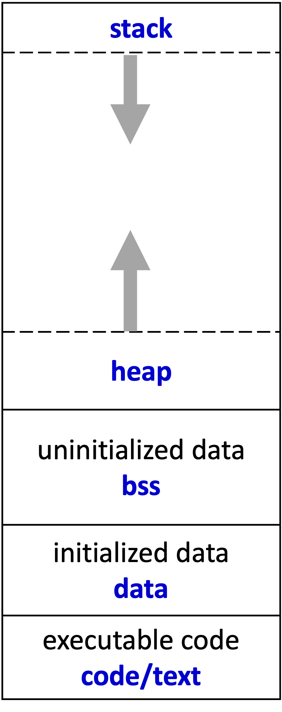

# Day 5: 指针与动态内存管理

指针在C/C++中可以用来访问特定的内存位置，并且具有很高的效率。它是C/C++的独特优势之一，也是一个具有挑战性的知识点。使用指针时必须非常小心，否则很容易引入一些难以察觉的错误。

## 指针

首先，我们需要理解指针是一种存储地址的变量。和其他类型的变量一样，指针也有自己的值，而这个值是一个内存地址。

有一个运算符`&`，它可以返回一个变量或对象的地址。如果我们有一个变量`int num = 10;`，我们可以通过`&num`获取`num`的地址。然后我们可以声明一个指针，并将地址赋给它。

```cpp
int num = 10;
int *p1 = NULL, *p2 = NULL; // 声明两个指针，并初始化为0
p1 = &num; // 获取num的地址并赋给p1
p2 = &num; // 获取num的地址并赋给p2
*p1 = 20; // 将20赋给num
*p2 = 30; // 将30赋给num
```



在上述代码中，我们声明了两个指针`p1`和`p2`，并将`num`的地址赋给了它们。这意味着这两个指针指向同一个内存位置，并且它们都认为该位置存储了一个`int`类型的值。

另一个运算符是`*`，用于指针解引用。它可以解引用指针以访问对象。以下两行代码是等价的，因为`p1`是一个指向`num`的指针。

```cpp
*p1 = 20;
num = 20;
```

指针不仅可以指向基本类型（如`int`、`float`），还可以指向结构体对象、类对象甚至函数。在以下代码中，我们声明并初始化了一个结构体`stu`，然后将`stu`的地址赋给指针`pStu`。结构体和指针的内存布局如图所示。

由于`stu`是一个结构体，我们可以使用点运算符`.`来访问其成员，例如`stu.name`。我们也可以通过`stu`的指针`pStu`来访问其成员，但此时需要使用`->`运算符，而不是`.`。`stu.name`等价于`pStu->name`。

```cpp
struct Student
{
    char name[4];
    int born;
    bool male;
};
// 声明并初始化一个结构体
Student stu = {"Yu", 2000, true};
// 将stu的地址赋给pStu
Student *pStu = &stu;
// 通过指针pStu修改结构体的成员
strncpy(pStu->name, "Li", 4);
pStu->born = 2001;
(*pStu).born = 2002;
pStu->male = false;
```



指针中存储的地址值可以通过以下代码打印出来。

```cpp
printf("stu的地址：%p\n", pStu); // C风格
cout << "stu的地址：" << pStu << endl; // C++风格
cout << "stu的地址：" << &stu << endl;
cout << "成员name的地址：" << &(pStu->name) << endl;
cout << "成员born的地址：" << &(pStu->born) << endl;
cout << "成员male的地址：" << &(pStu->male) << endl;
```

地址是一个无符号整数。在大多数32位操作系统中，它是一个32位无符号整数，而在大多数当前的64位系统中，它是一个64位无符号整数。你可以运行以下代码来检查你的系统使用多少位来表示地址。

```cpp
cout << "sizeof(int *) = " << sizeof(int *) << endl; // 4或8
cout << "sizeof(Student *) = " << sizeof(Student *) << endl; // 4或8
cout << "sizeof(pStu) = " << sizeof(pStu) << endl; // 4或8
```

```cpp
#include <iostream>
#include <cstring>
using namespace std;

struct Student
{
    char name[4];
    int born;
    bool male; 
};

int main()
{
    Student stu = {"Yu", 2000, true};
    Student * pStu = &stu;

    cout << stu.name << " was born in " << stu.born 
         << ". Gender: " << (stu.male ? "male" : "female") << endl;

    strncpy(pStu->name, "Li", 4);
    pStu->born = 2001;
    (*pStu).born = 2002;
    pStu->male = false;

    cout << stu.name << " was born in " << stu.born 
         << ". Gender: " << (stu.male ? "male" : "female") << endl;


    printf("Address of stu: %p\n", pStu); //C style
    cout << "Address of stu: " << pStu << endl; //C++ style
    cout << "Address of stu: " << &stu << endl;
    cout << "Address of member name: " << &(pStu->name) << endl;
    cout << "Address of member born: " << &(pStu->born) << endl;
    cout << "Address of member male: " << &(pStu->male) << endl;

    cout << "sizeof(pStu) = " << sizeof(pStu) << endl;
    
    return 0;
}
```

### 指针的指针

由于指针本身也是一个变量，它也会存储在内存中并有自己的地址。因此，另一个指针可以指向这个指针。下图展示了变量`num`的内存布局。指针`p`指向`num`，而指针`pp`指向`p`。`*(*pp) = 20`会将`num`的值修改为20，这等价于`*p = 20`和`num = 20`。



```cpp
// pointer-pointer.cpp
#include <iostream>
using namespace std;

int main()
{
    int num = 10;
    int *p = &num;
    int **pp = &p;
    *(*pp) = 20;

    cout << "num = " << num << endl;

    return 0;
}
```

### 常量指针

如果在基本类型前面加上`const`类型修饰符，例如`const int num = 1;`，那么`num`的值在初始化后就不能被修改了。

如果在指针的类型名前面加上`const`，如下例所示，那么你不能通过指针修改它所指向的值。

```cpp
int num = 1;
// 不能通过p1修改它所指向的值
const int *p1 = &num;
*p1 = 3; // 错误
num = 3; // 可以
```

但是你可以修改指针本身。

```cpp
p1 = &another; // 可以
```

`const`也可以放在`*`和变量名之间。如果这样，指针将永久指向该内存地址，不能指向其他地方。但是该内存中的值可以被修改。

```cpp
// 不能修改p2的值（地址）
int *const p2 = &num;
*p2 = 3; // 可以
p2 = &another; // 错误
```

如果同时使用两个`const`，如下例所示，那么既不能修改地址，也不能修改值。

```cpp
// 两者都不能修改
const int* const p3 = &num;
*p3 = 3; // 错误
p3 = &another; // 错误
```

### 指针与数组

数组中的元素也存储在内存中，并且有自己的地址。以下代码展示了如何获取数组中前4个元素的地址，并将它们分别赋给4个指针变量。打印这些地址后，你会发现这些地址之间的间隔是`sizeof(Student)`。可以通过`students[1].born`或`p1->born`访问第二个元素的`born`成员。

```cpp
// pointer-array.cpp
Student students[128];
Student *p0 = &students[0];
Student *p1 = &students[1];
Student *p2 = &students[2];
Student *p3 = &students[3];

printf("p0 = %p\n", p0);
printf("p1 = %p\n", p1);
printf("p2 = %p\n", p2);
printf("p3 = %p\n", p3);

// 相同的行为
students[1].born = 2000;
p1->born = 2000;
```

在我的计算机上，上述代码的输出结果为：

```bash
p0 = 0x16f3d6e58
p1 = 0x16f3d6e64
p2 = 0x16f3d6e70
p3 = 0x16f3d6e7c
```

可以将数组名视为一个指针。数组名和指针的区别在于，数组名只能指向同一块内存。数组名可以被视为一个指向固定内存地址的常量指针。

我们打印`&students`、`students`和`&students[0]`的值，你会发现这三个地址是相同的，都是数组`students`的第一个元素的地址。

```cpp
// pointer-array.cpp
printf("&students = %p\n", &students);
printf("students = %p\n", students);
printf("&students[0] = %p\n", &students[0]);
```

在我的计算机上，上述代码的输出结果为：

```bash
&students = 0x16f3d6e58
students = 0x16f3d6e58
&students[0] = 0x16f3d6e58
```

如果我们将数组（地址）赋给一个指针`p`，那么`p`就可以像数组一样使用（`p[0]`）来访问元素。`p`是一个指向内存位置的指针，并且将该位置视为一个对象的起始地址。但是`p`并不知道后面有多少个元素。我们必须非常小心，避免越界错误。

```cpp
// pointer-array.cpp
Student *p = students;
p[0].born = 2000;
p[1].born = 2001;
p[2].born = 2002;
```

由于指针的值是一个地址（整数），因此可以在指针上进行算术运算。但请注意，执行`p + 1`后，地址并不会增加1。`p + num`或`num + p`指向数组`p`的第`num`个元素。`p - num`指向第`(-num)`个元素。地址值的变化取决于数据类型。如果数据类型是`float *`，那么执行`p + 1`或`p++`后，地址将增加4个字节。

```cpp
// arithmetic.cpp
int numbers[4] = {0, 1, 2, 3};
int *p = numbers + 1; // 指向值为1的元素
p++; // 指向值为2的元素

*p = 20; // 将numbers[2]从2改为20
*(p - 1) = 10; // 将numbers[1]从1改为10
p[1] = 30; // 将numbers[3]从3改为30
```



我们不知道指针指向的地址后面有多少个元素，也不知道指针是来自一个整数还是一个整数数组。以下代码可以成功编译，但内存访问可能会越界。

```cpp
// bound.cpp
int num = 0;
int *p = &num;
p[-1] = 2; // 越界
p[0] = 3; // 可以
*(p + 1) = 4; // 越界
```

## 分配内存：C风格

当一个程序由操作系统（OS）执行时，OS会为程序分配内存。程序的内存可以分为5个部分，如下图所示。



* **代码段**：包含可执行代码。它是只读的，并且大小固定。
* **数据段**：包含已初始化的静态变量，包括全局静态变量和局部静态变量。
* **BSS段**：BSS段包含未初始化的静态数据。
* **堆**：包含动态分配的内存。通过`malloc()`或`new`分配的内存位于此段。
* **栈**：局部变量和调用栈存储在此处。
